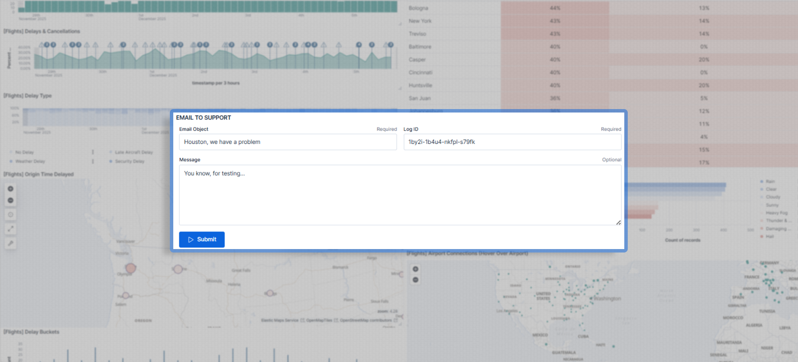
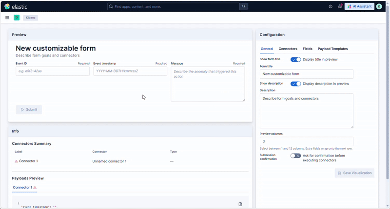

<p align="center">
  
</p>

# Customizable Form Plugin

Customizable Form is a Kibana plugin that delivers “form-based” visualizations to collect user input and trigger Kibana Action connectors directly from inside a dashboard.

---

## Features
- Customization of the form composition in terms of number of columns, title, description
- Choice of any Kibana Connector you have previously created (as for now only the Index, Webhook, Email, Jira and MS Teams are supported), even more than one that must be triggered at the same time (e.g. the same submission must open a Jira ticket and send an email)
- Personalization of all the fields in terms of:
  - order in the form
  - label 
  - variable name (to be used in the payload template)
  - placeholder
  - input type (single or multiline)
  - data type (string, number or boolean)
  - min/max size (characters for strings or lower/upper bounds for number)
  - mandatoriness of a field (optional or required)
- Personalization of the payload templates that will be used by the connector (some connectors require specific template)
- Fields and parameters checks, inhibiting the visualization saving, in order to prevent any possible mistake
- Real time preview in edit mode
- Submission timestamp usable in payload templates via the `__submission_timestamp__` variable
- Optional confirmation modal before submission

---

## Demo


---

## Getting Started

### Install on Kibana

Every release package includes a Plugin version (X.Y.Z) and a Kibana version (A.B.C).

- Go to [releases](https://github.com/fabiopipitone/customizable_form/releases) and choose the right one for your Kibana version
- launch a shell terminal and go to $KIBANA_HOME folder
- use Kibana CLI to install :
  - directly from Internet URL :
`./bin/kibana-plugin install https://github.com/fabiopipitone/customizable_form/releases/download/vX.Y.Z/customizableForm-X.Y.Z-kibana-A.B.C.zip`
  - locally after manual download :
`./bin/kibana-plugin install file:///path/to/customizableForm-X.Y.Z_A.B.C.zip`
- restart Kibana

---

## Structured connector payloads

Some connectors require a specific JSON structure. The builder enforces the most common subset of rules so users catch mistakes before hitting the connector API.

- **Email (`.email`)** — the template must render:

  ```json
  {
    "to": ["<target email address>"],
    "subject": "<email subject>",
    "message": "<email message>"
  }
  ```

  Optional fields such as `cc`, `bcc`, `messageHTML`, and `attachments` are supported, but the validator requires at least one recipient plus subject/message strings.

- **Jira (`.jira`)** — the template must render a `pushToService` payload:

  ```json
  {
    "subAction": "pushToService",
    "subActionParams": {
      "incident": {
        "summary": "<issue summary>",
        "description": "<issue description>",
        "issueType": "Task",
        "priority": "Medium"
      }
    }
  }
  ```

  You may add `issueType`, `priority`, `parent`, `labels`, or `comments` manually, but copy the exact values/IDs from the Jira connector test panel (or your Jira project) to avoid downstream failures. Additional fields are intentionally blocked.

- **Microsoft Teams (`.teams`)** — payloads must include the `message` field:

  ```json
  {
    "message": "{{message}}"
  }
  ```

  Optional fields are not supported; any extra keys will trigger an error in the builder.

- **Submission timestamp** — regardless of connector type, you can inject the ISO timestamp of the submission via `{{__submission_timestamp__}}`. The actual value is filled when the user clicks Submit.

Invalid structures surface directly in the Payload tab and block both Save and Submit.

---

## Development & Contribution

### Environment requirements
- [nvm](https://github.com/nvm-sh/nvm), not strictly needed but highly recommended to handle Node.js versions
- [docker](https://docs.docker.com/engine/install/), needed to start a testing ES environment via scripts/es-switch.sh script
- [yarn](https://classic.yarnpkg.com/lang/en/docs/install/#windows-stable)
- PATIENCE, almost mandatory when it comes to kbn bootstrap and kbn/optimizer steps

### Quick setup
```bash
git clone https://github.com/elastic/kibana.git
git checkout tags/vA.B.C # with A.B.C the kibana version
nvm use
yarn kbn bootstrap
```

Then, launch an Elasticsearch node with docker using the bash script in `scripts/es-switch.sh A.B.C`. 
This script stops any `es-*` container already running, pulls the Elasticsearch docker image of the needed version (if not among the images already) and run/start the container with that image. Then create the user `kibana_dev` with password `kibana_dev_pwd` one can use when developing the plugin.
If the script is launched with `--trial` it also starts the 30-day trial license on Elasticsearch.

To check everythin works properly (without the plugin) move to the `kibana` root directory, add the following lines in the `config/kibana.yml` file:

```yml
elasticsearch.username: kibana_dev
elasticsearch.password: kibana_dev_pwd
```

Then, in the terminal, launch kibana with

```bash
yarn start
```

Wait for it to start (if it's the first time it'll take a while because of the `@kbn/optimizer`). 
Then open your browser at `http://localhost:5601`, login with credentials `elastic,elastic_pwd` and check everything works as expected.

If so, proceed adding the plugin. 
Stop kibana and, from the kibana root folder, go with:

```bash
cd plugins
git clone https://github.com/fabiopipitone/customizable_form.git
yarn dev --watch
```

Leave both the kibana console (with `yarn start`) and the plugin console (`yarn dev --watch`) running while developing.

### Testing and building

When done developing, from inside `plugins/customizable_form`, run the tests (and enrich them if new features are added) with 

```bash
node ../../scripts/jest
```

When done, to build the plugin you can use the `scripts/build_for_kbn.sh` script, like this:

```bash
scripts/build_for_kbn.sh A.B.C # with A.B.C the kibana version to build the plugin for
```

The zip file will be created inside the `dist` folder.

---

## Appendices

### A. Testing matrix (excerpt)
| Test file | Coverage |
|-----------|----------|
| `public/components/form_builder/__tests__/form_builder.test.tsx` | Builder spinner/error/layout states. |
| `public/components/form_builder/__tests__/form_builder_layout.test.tsx` | Panel wiring + submit confirmation. |
| `public/components/form_builder/__tests__/configuration_panel.test.tsx` | Tabs + Save button state. |
| `public/components/form_builder/hooks/__tests__/use_form_builder_lifecycle.test.tsx` | Lifecycle hook orchestration (mocked services). |
| `public/components/form_builder/hooks/__tests__/use_connector_state.test.tsx` | Connector summaries, warnings, errors. |
| `public/components/form_builder/hooks/__tests__/use_payload_templates.test.tsx` | Payload rendering + validation. |
| `public/components/form_builder/hooks/__tests__/use_connector_execution.test.tsx` | Submit flow, confirmation modal, error handling. |
| `public/components/form_builder/hooks/__tests__/use_field_validation.test.tsx` | Field + variable name validation maps and flags. |
| `public/components/form_builder/utils/__tests__/form_helpers.test.ts` | Field value helpers, error message extraction. |
| `public/components/form_builder/utils/__tests__/shared.test.ts` | Connector summary builder utilities. |
| `public/components/form_builder/__tests__/preview_card.test.tsx` / `info_panel.test.tsx` | Component rendering, prop forwarding, warning badges. |
| `public/components/form_builder/__tests__/serialization.test.ts` | Layout/size normalization + round-trip serialization. |
| `public/components/form_builder/__tests__/validation.test.ts` | `validateVariableName` rules. |
| `public/embeddable/__tests__/customizable_form_embeddable.test.tsx` | Embeddable load/error/success + confirmation logic. |
---

## Donation

If you like the project and want to support me, any amount will be highly appreciated!

[](https://www.paypal.com/donate/?hosted_button_id=QZ9G77DVB9XWN)
